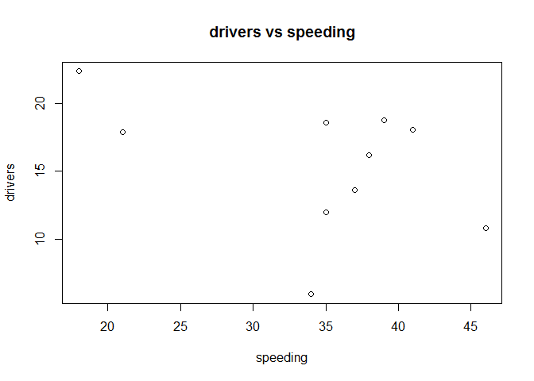

## Get some data

```r
# Get some data from fivethirtyeight.com
# install.packages("fivethirtyeight")
library(fivethirtyeight)
data(package = "fivethirtyeight")
```

## Choose a data set
The data set I am interested in is "bad_drivers". This data set mainly describes the raw data behind the story "Dear Mona, Which State Has The Worst Drivers?". For more infromation, please visit [fivethirtyeight](https://fivethirtyeight.com/features/which-state-has-the-worst-drivers/)


## Show the data

```
##     state            num_drivers    perc_speeding    perc_alcohol  
##  Length:51          Min.   : 5.90   Min.   :13.00   Min.   :16.00  
##  Class :character   1st Qu.:12.75   1st Qu.:23.00   1st Qu.:28.00  
##  Mode  :character   Median :15.60   Median :34.00   Median :30.00  
##                     Mean   :15.79   Mean   :31.73   Mean   :30.69  
##                     3rd Qu.:18.50   3rd Qu.:38.00   3rd Qu.:33.00  
##                     Max.   :23.90   Max.   :54.00   Max.   :44.00  
##  perc_not_distracted perc_no_previous insurance_premiums     losses      
##  Min.   : 10.00      Min.   : 76.00   Min.   : 642.0     Min.   : 82.75  
##  1st Qu.: 83.00      1st Qu.: 83.50   1st Qu.: 768.4     1st Qu.:114.64  
##  Median : 88.00      Median : 88.00   Median : 859.0     Median :136.05  
##  Mean   : 85.92      Mean   : 88.73   Mean   : 887.0     Mean   :134.49  
##  3rd Qu.: 95.00      3rd Qu.: 95.00   3rd Qu.:1007.9     3rd Qu.:151.87  
##  Max.   :100.00      Max.   :100.00   Max.   :1301.5     Max.   :194.78
```

<!--html_preserve--><div id="htmlwidget-27ea47b35d7f771bbc01" style="width:100%;height:auto;" class="datatables html-widget"></div>
<script type="application/json" data-for="htmlwidget-27ea47b35d7f771bbc01">{"x":{"filter":"none","data":[["1","2","3","4","5","6","7","8","9","10","11","12","13","14","15","16","17","18","19","20","21","22","23","24","25","26","27","28","29","30","31","32","33","34","35","36","37","38","39","40","41","42","43","44","45","46","47","48","49","50","51"],["Alabama","Alaska","Arizona","Arkansas","California","Colorado","Connecticut","Delaware","District of Columbia","Florida","Georgia","Hawaii","Idaho","Illinois","Indiana","Iowa","Kansas","Kentucky","Louisiana","Maine","Maryland","Massachusetts","Michigan","Minnesota","Mississippi","Missouri","Montana","Nebraska","Nevada","New Hampshire","New Jersey","New Mexico","New York","North Carolina","North Dakota","Ohio","Oklahoma","Oregon","Pennsylvania","Rhode Island","South Carolina","South Dakota","Tennessee","Texas","Utah","Vermont","Virginia","Washington","West Virginia","Wisconsin","Wyoming"],[18.8,18.1,18.6,22.4,12,13.6,10.8,16.2,5.9,17.9,15.6,17.5,15.3,12.8,14.5,15.7,17.8,21.4,20.5,15.1,12.5,8.2,14.1,9.6,17.6,16.1,21.4,14.9,14.7,11.6,11.2,18.4,12.3,16.8,23.9,14.1,19.9,12.8,18.2,11.1,23.9,19.4,19.5,19.4,11.3,13.6,12.7,10.6,23.8,13.8,17.4],[39,41,35,18,35,37,46,38,34,21,19,54,36,36,25,17,27,19,35,38,34,23,24,23,15,43,39,13,37,35,16,19,32,39,23,28,32,33,50,34,38,31,21,40,43,30,19,42,34,36,42],[30,25,28,26,28,28,36,30,27,29,25,41,29,34,29,25,24,23,33,30,32,35,28,29,31,34,44,35,32,30,28,27,29,31,42,34,29,26,31,38,41,33,29,38,16,30,27,33,28,33,32],[96,90,84,94,91,79,87,87,100,92,95,82,85,94,95,97,77,78,73,87,71,87,95,88,10,92,84,93,95,87,86,67,88,94,99,99,92,67,96,92,96,98,82,91,88,96,87,82,97,39,81],[80,94,96,95,89,95,82,99,100,94,93,87,98,96,95,87,85,76,98,84,99,80,77,88,100,84,85,90,99,83,78,98,80,81,86,82,94,90,88,79,81,86,81,87,96,95,88,86,87,84,90],[784.55,1053.48,899.47,827.34,878.41,835.5,1068.73,1137.87,1273.89,1160.13,913.15,861.18,641.96,803.11,710.46,649.06,780.45,872.51,1281.55,661.88,1048.78,1011.14,1110.61,777.18,896.07,790.32,816.21,732.28,1029.87,746.54,1301.52,869.85,1234.31,708.24,688.75,697.73,881.51,804.71,905.99,1148.99,858.97,669.31,767.91,1004.75,809.38,716.2,768.95,890.03,992.61,670.31,791.14],[145.08,133.93,110.35,142.39,165.63,139.91,167.02,151.48,136.05,144.18,142.8,120.92,82.75,139.15,108.92,114.47,133.8,137.13,194.78,96.57,192.7,135.63,152.26,133.35,155.77,144.45,85.15,114.82,138.71,120.21,159.85,120.75,150.01,127.82,109.72,133.52,178.86,104.61,153.86,148.58,116.29,96.87,155.57,156.83,109.48,109.61,153.72,111.62,152.56,106.62,122.04]],"container":"<table class=\"display\">\n  <thead>\n    <tr>\n      <th> <\/th>\n      <th>state<\/th>\n      <th>num_drivers<\/th>\n      <th>perc_speeding<\/th>\n      <th>perc_alcohol<\/th>\n      <th>perc_not_distracted<\/th>\n      <th>perc_no_previous<\/th>\n      <th>insurance_premiums<\/th>\n      <th>losses<\/th>\n    <\/tr>\n  <\/thead>\n<\/table>","options":{"columnDefs":[{"className":"dt-right","targets":[2,3,4,5,6,7,8]},{"orderable":false,"targets":0}],"order":[],"autoWidth":false,"orderClasses":false}},"evals":[],"jsHooks":[]}</script><!--/html_preserve-->

states                  drivers   speeding   alchol   not distracted
---------------------  --------  ---------  -------  ---------------
Alabama                    18.8         39       30               96
Alaska                     18.1         41       25               90
Arizona                    18.6         35       28               84
Arkansas                   22.4         18       26               94
California                 12.0         35       28               91
Colorado                   13.6         37       28               79
Connecticut                10.8         46       36               87
Delaware                   16.2         38       30               87
District of Columbia        5.9         34       27              100
Florida                    17.9         21       29               92


## Add some Latex formulas
We can assume that there is a linear relationship between drivers and speeding.
$$num_drivers = \alpha*speeding + 4.5*\beta$$


## Add a plot

```r
plot(drivers~speeding, df, main="drivers vs speeding")
```

<!-- -->


## Add a picture


## Add footnote and block quote
> The driver is the most important factor in keeping driving from being a ¡°cinch.¡± Automotive engineering may make the car easier to drive. Highway engineering and traffic engineering may make the highways and streets safer to use. Safety devices and clever inventions may help lessen the hazards in unfavorable weather conditions. But, in spite of all such improvements, first-rate driving will always demand that the driver act in accordance with sportsmanlike attitudes. [^1]

[^1]: Here is the footnote.
