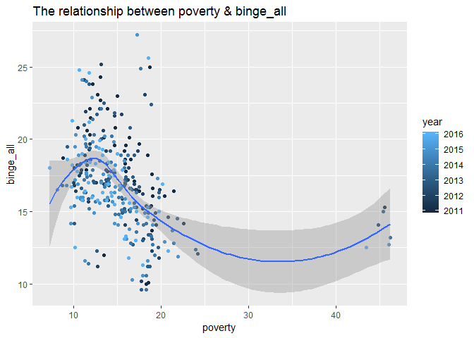

## Choose a Data Set
The data we want to use as following: [U.S. Chronic Disease Indicators (CDI)](https://data.cdc.gov/Chronic-Disease-Indicators/U-S-Chronic-Disease-Indicators-CDI-/g4ie-h725).


## Selection of Data and Tidying
My idea to solve this question: There are 34 columns in the original excel, but according to the requirements of the question, we only need to keep the columns related to the analysis, so we choose the following columns, and filter the data. We only keep the data related to ***Bing Drinking*** and ***Poverty***.


## Data Transformation
##### Question 5: Produce a table that shows the overall, female, and male binge drinking prevalences across U.S. States in the most recent year of data for the Top 10 binge drinking states. Use the relevant dplyr commands to select the right variables, sort the data and filter the data frame.


```
##    year                state stateabb Overall Female Male
## 1  2016 District of Columbia       DC    25.6   21.3 30.5
## 2  2016         North Dakota       ND    24.8   17.2 32.1
## 3  2016            Wisconsin       WI    24.6   19.5 29.7
## 4  2016            Minnesota       MN    21.3   16.2 26.5
## 5  2016                 Iowa       IA    21.2   15.4 27.1
## 6  2016                 Guam       GU    20.7   11.2 29.8
## 7  2016             Nebraska       NE    20.0   13.1 27.2
## 8  2016             Illinois       IL    19.9   14.5 25.6
## 9  2016         Pennsylvania       PA    19.4   13.8 25.3
## 10 2016         South Dakota       SD    19.3   14.3 24.3
```


##### Question 6: Make a simple scatter plot showing the correlation between the overall poverty prevalence in a state and the prevalence of binge drinking in the overall population. Add a loess smoothed fit curve to indicate the pattern. Comment briefly.
<!-- -->

Comment Briefly: According to the scatter plot, it can be seen that there is a non-linear relationship between binge_all and poverty(as the blue curve shows). Also, there is a peak between 10 and 15, and I suppose that the peak value corresponding to the value of x-axis is 13(approximate). When binge_all is less than 13, binge_all is **proportional** to poverty, which means that the increase in the percentage of drinking prevalence among all adults, the increase in the percentage of poverty of the state. When binge_all is between 13 and 17.5, binge_all is **inversely proportional** to poverty, which means that the increase in the percentage of drinking prevalence among all adults, the decrease in the percentage of poverty of the state. Later, the curve starts to become flat between 17.5 and 22.5, almost parallel to the x-axis, which means that there is no correlation between binge_all and poverty. And then, when binge_all is larger than 22.5, the curve is gradually increasing, the two variables are **proportional** again.


##### Question 7: Calculate the average annual growth rates (in percent) of overall binge drinking across states for the years the data is available. Provide a table of the 5 states with the largest increases and the 5 states with the largest decreases in binge drinking prevalence over the time period.


```
## # A tibble: 5 x 2
##   state          growth_rate
##   <chr>                <dbl>
## 1 Tennessee             6.20
## 2 Guam                  2.62
## 3 West Virginia         2.38
## 4 South Carolina        1.82
## 5 Arkansas              1.28
```


```
## # A tibble: 5 x 2
##   state        growth_rate
##   <chr>              <dbl>
## 1 Oklahoma           -5.70
## 2 Georgia            -3.98
## 3 Rhode Island       -3.88
## 4 Puerto Rico        -3.66
## 5 Delaware           -3.25
```
