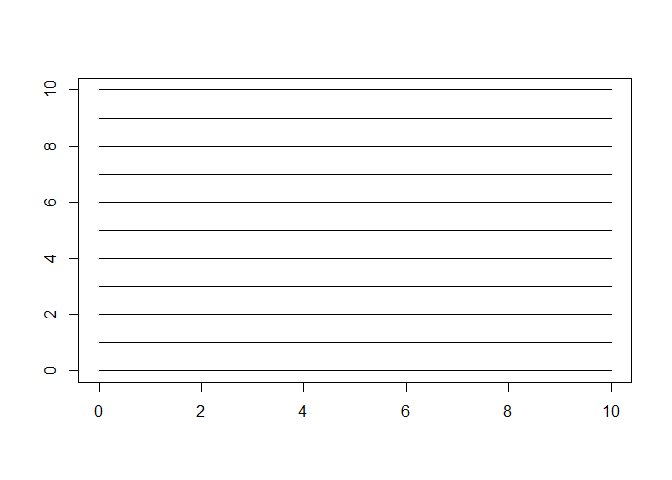
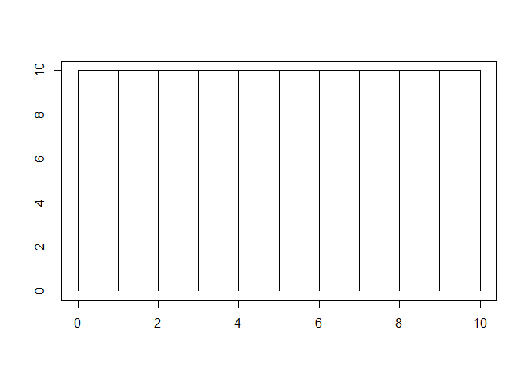
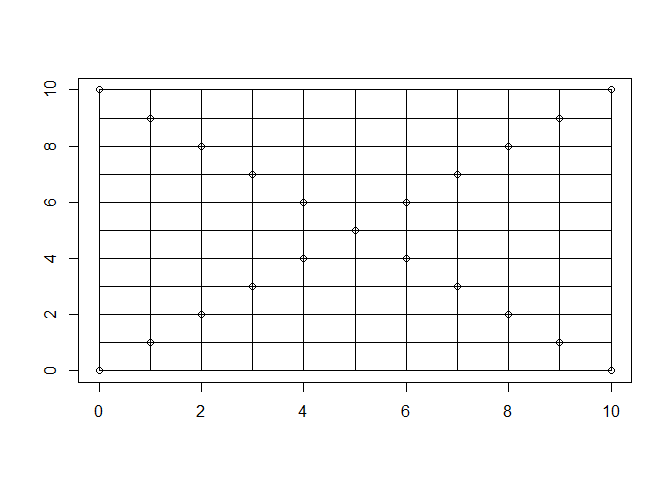

## Beer Song
The lyrics we want to use as following: [99 Bottles of Beer on the Wall](https://www.mamalisa.com/?t=es&p=2412).


#### a) Write a loop
Considering the singular & plural of "1 bottle"(no "s"), I have divided into "i>1" and "i=1".

```r
# Loop from 99 to 1
for(i in 99:0){
  if(i>1){
    cat("\n", i, "bottles of beer on the wall,", i, "bottles of beer. Take one down, pass it around,", 
        (i-1), "bottles of beer on the wall...", sep = " ")
  }else if(i==1){
    cat("\n", i, "bottle of beer on the wall,", i, "bottle of beer. Take one down, pass it around,", 
        "no more bottles of beer on the wall...", sep = " ")
  }else{
    cat("\n No more bottles of beer on the wall, no more bottles of beer.", 
        "\n Go to the store and buy some more, 99 bottles of beer on the wall...",
        sep = " ")
  }
}
```


```
## 
##  99 bottles of beer on the wall, 99 bottles of beer. Take one down, pass it around, 98 bottles of beer on the wall...
##  98 bottles of beer on the wall, 98 bottles of beer. Take one down, pass it around, 97 bottles of beer on the wall...
##  97 bottles of beer on the wall, 97 bottles of beer. Take one down, pass it around, 96 bottles of beer on the wall...
##  96 bottles of beer on the wall, 96 bottles of beer. Take one down, pass it around, 95 bottles of beer on the wall...
##  95 bottles of beer on the wall, 95 bottles of beer. Take one down, pass it around, 94 bottles of beer on the wall...
```


#### b) Convert loop to a function

```r
Beer_Song <- function(type = "beer", n = 99){
  for(i in n:0){
    if(i>1){
      cat("\n", i, "bottles of", type, "on the wall,", 
          i, "bottles of", paste(type, ". Take one down, pass it around,", sep = ""), 
          (i-1), "bottles of", type, "on the wall...", sep = " ")
    }else if(i==1){
      cat("\n", i, "bottle of", type, "on the wall,", 
          i, "bottle of", paste(type, ". Take one down, pass it around,", sep = ""), 
          "no more bottles of", type, "on the wall...", sep = " ")
    }else{
      cat("\n No more bottles of", type, "on the wall, no more bottles of", 
          paste(type, ". \n Go to the store and buy some more,", sep = ""), 
          n, "bottles of", type, "on the wall...", sep = " ")
    }
  }
}

# Print out the Beer_Song
Beer_Song("Whiskey", 3)
```

```
## 
##  3 bottles of Whiskey on the wall, 3 bottles of Whiskey. Take one down, pass it around, 2 bottles of Whiskey on the wall...
##  2 bottles of Whiskey on the wall, 2 bottles of Whiskey. Take one down, pass it around, 1 bottles of Whiskey on the wall...
##  1 bottle of Whiskey on the wall, 1 bottle of Whiskey. Take one down, pass it around, no more bottles of Whiskey on the wall...
##  No more bottles of Whiskey on the wall, no more bottles of Whiskey. 
##  Go to the store and buy some more, 3 bottles of Whiskey on the wall...
```


#### c) Add error check

```r
Beer_Song <- function(type = "beer", n = 99){
  if(mode(n) != "numeric"){
    warning("Non-numeric input to the number of bottles!")
  }else{
    for(i in n:0){
      if(i>=1){
        cat("\n", i, "bottles of", type, "on the wall,", 
            i, "bottles of", paste(type, ". Take one down, pass it around,", sep = ""), 
            (i-1), "bottles of", type, "on the wall...", sep=" ")
      }else{
        cat("\n No more bottles of", type, "on the wall, no more bottles of", 
            paste(type, ". \n Go to the store and buy some more,", sep = ""), 
            n, "bottles of", type, "on the wall...", sep = " ")
      }
    }
  }
}

# Print out the Beer_Song
Beer_Song("Whiskey", n = "two")
```

```
## Warning in Beer_Song("Whiskey", n = "two"): Non-numeric input to the number
## of bottles!
```


#### d) Convert loop to a fully generalized function

```r
Beer_Song <- function(liquid = "beer", vessel = "bottles", container = "wall", n = 99){
  for(i in n:0){
    if(i>1){
      cat("\n ", i, " ", vessel, " of ", liquid, " on the ", container, ", ", 
          i, " ", vessel ," of ", liquid, ". Take one down, pass it around, ", 
          (i-1), " ", vessel, " of ", liquid, " on the ", container, "...", sep="")
    }else if(i==1){
      cat("\n ", i, " ", vessel, " of ", liquid, " on the ", container, ", ", 
          i, " ", vessel, " of ", liquid, ". Take one down, pass it around, no more ", 
          vessel, " of ", liquid, " on the ", container, "...", sep = "")
    }else{
      cat("\n No more ", vessel, " of ", liquid, " on the ", container, 
          ", no more ", vessel, " of ", liquid, ".",
          "\n Go to the store and buy some more, ", n, " ", vessel, " of ", liquid, 
          " on the ", container, "...", sep = "")
    }
  }
}

# Print out the Beer_Song
Beer_Song(n = 3, vessel = "jugs", liquid = "milk",  container = "shelf")
```

```
## 
##  3 jugs of milk on the shelf, 3 jugs of milk. Take one down, pass it around, 2 jugs of milk on the shelf...
##  2 jugs of milk on the shelf, 2 jugs of milk. Take one down, pass it around, 1 jugs of milk on the shelf...
##  1 jugs of milk on the shelf, 1 jugs of milk. Take one down, pass it around, no more jugs of milk on the shelf...
##  No more jugs of milk on the shelf, no more jugs of milk.
##  Go to the store and buy some more, 3 jugs of milk on the shelf...
```


## Draw a Plot using a Loop
#### a) Plot with horizontal lines

```r
plot(1, type = "n", xlab = "", ylab = "", xlim = c(0, 10), ylim = c(0, 10))
for(i in 0:10){
  lines(y = c(i,i), x = c(0,10))
}
```

<!-- -->


#### b) Add vertical lines

```r
plot(1, type = "n", xlab = "", ylab = "", xlim = c(0, 10), ylim = c(0, 10))
for(i in 0:10){
  lines(y = c(i,i), x = c(0,10))
  lines(x = c(i,i), y = c(0,10))
}
```

<!-- -->


#### c) Add points

```r
plot(1, type = "n", xlab = "", ylab = "", xlim = c(0, 10), ylim = c(0, 10))
for(i in 0:10){
  lines(y = c(i,i), x = c(0,10))
  lines(x = c(i,i), y = c(0,10))
  points(x = i, y = i)
  points(x = i, y = 10-i)
}
```

<!-- -->


#### d) Convert to function

```r
plot_lines <- function(horizontal=T, vertical=T, points=T, Lower_boundary=0, Upper_boundary=10){
  plot(1, type = "n", xlab = "", ylab = "", 
       xlim = c(Lower_boundary, Upper_boundary), ylim = c(Lower_boundary, Upper_boundary))
  for(i in Lower_boundary:Upper_boundary){
    if(horizontal==T){
      lines(y = c(i,i), x = c(Lower_boundary, Upper_boundary))
    }
    if(vertical==T){
      lines(x = c(i,i), y = c(Lower_boundary, Upper_boundary))
    }
    if(points==T){
      points(x = i, y = i)
      points(x = i, y = Lower_boundary+(Upper_boundary-i))
    }
  }
}
```


## Descriptive Statistics of a Vector with Error Checks
#### a) Calculate min and max

```r
desc_stats <- function(vector){
  vector <- vector[!is.na(vector)]
  cat("Max:", max(vector), "Min:", min(vector))
}

# Print out the desc_stats
desc_stats(c(1, 2, 3, NA))
```

```
## Max: 3 Min: 1
```


#### b) Add the median

```r
desc_stats <- function(vector, med = FALSE){
  vector <- vector[!is.na(vector)]
  cat("Max:", max(vector), "Min:", min(vector))
  if(med == TRUE){
    cat(" Median:", round(median(vector), digits = 2))
  }
}

# Print out the desc_stats
desc_stats(c(1, 2, 3, 4, NA), med = TRUE)
```

```
## Max: 4 Min: 1 Median: 2.5
```


#### c) Add error checks

```r
desc_stats <- function(vector, med=FALSE){
  if((length(vector[!duplicated(vector)])==1 & is.na(vector[!duplicated(vector)][1])) | 
     length(vector)==0){return("Vector is empty!")
  }else{
    vector <- vector[!is.na(vector)]
    cat("Max:", max(vector), "Min:", min(vector))
    if(med==TRUE){
      cat("Median:", round(median(vector), digits = 2))
    }
  }
}

# Print out the desc_stats
desc_stats(c(NA, NA), med = TRUE)
```

```
## [1] "Vector is empty!"
```


