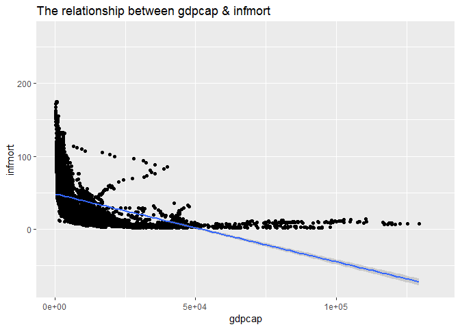
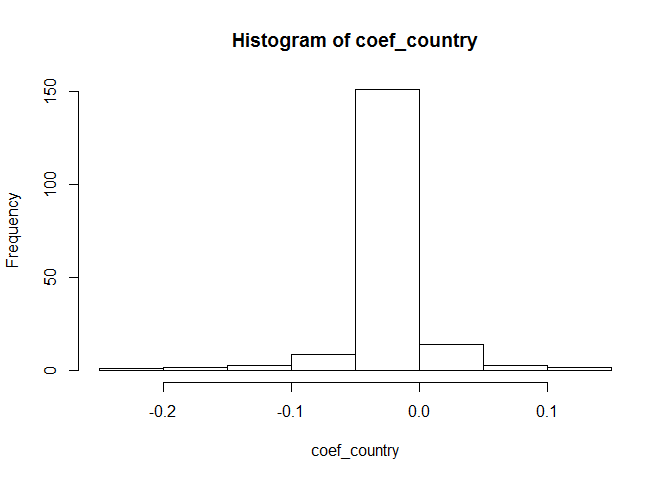

## Functions in the R Base Package


#### a) Longest name
My idea to solve this question: I will use names() function to obtain the names of all functions, and then use map() function to compute the length of all function names, where the results are stored in the "length_names" variable with the "list" storage format. In order to compute the maximum, I will use max() function, which needs to be converted to the "vector" format. Finally, calculation results show that the function with the longest name is "getDLLRegisteredRoutines.character", a total of 34 characters.


##### **Function with the longest name**

```
## [1] "getDLLRegisteredRoutines.character"
```

##### **Number of characters**

```
## [1] 34
```


#### b) Number of arguments


```
##           function. number_arguments
## 1              scan               22
## 2    format.default               16
## 3            source               16
## 4           formatC               14
## 5  merge.data.frame               13
## 6         prettyNum               12
## 7           system2               11
## 8              save               10
## 9            system               10
## 10          library                9
```


#### c) No arguments
Conclusion: By filtering, there are 224 functions with zero argument(no arguments). I think the differences are that most of these functions are basic operators, such as "+"" (addition), "<"(less than), "%%"(modulo), etc, but there are still some primitive functions in it.

```
## [1] 224
```


## Infant Mortality and GPD per Capita
Use the WDI package to obtain country-year data on infant mortality and GDP per capita from the World Bank database: [WDI Package](https://cran.r-project.org/web/packages/WDI/WDI.pdf)


#### a) Highest and lowest infant mortality rates in 2017


##### **Table of countries with the 5 highest infant mortality rates in 2017**

```
##                    country infmort    gdpcap
## 1 Central African Republic    87.6  661.2400
## 2             Sierra Leone    81.7 1390.3003
## 3                  Somalia    79.7        NA
## 4                     Chad    73.4 1768.1534
## 5         Congo, Dem. Rep.    70.0  808.1332
```

##### **Table of countries with the 5 lowest infant mortality rates in 2017**

```
##      country infmort   gdpcap
## 1    Iceland     1.6 46482.96
## 2   Slovenia     1.7 31400.84
## 3    Finland     1.9 40585.72
## 4      Japan     1.9 39002.22
## 5 San Marino     2.0 56861.47
```


#### b) Overall regression
Conclusion: According to the question, I regard ¡°gdpcap¡± as independent variable, ¡°infmort¡± as dependent variable. The fit line indicates that infmort is inversely proportional to gdpcap. Almost all of scatters concentrate on the bottom left corner of plot, with a lower gdpcap value but higher infmort value, which means that the lower GDP per capita, the higher infant mortality rate overall. Besides, in the range of 0 to 5e+04, the infant morality rate is falling very fast, but after that, the rate is gradually getting slowly, which means the impact of GDP per capita on infant mortality rate is not so significant.

```
## 
## Call:
## lm(formula = infmort ~ gdpcap, data = data_WDI_clean, subset = ((!is.na(gdpcap)) & 
##     (!is.na(infmort))))
## 
## Residuals:
##     Min      1Q  Median      3Q     Max 
## -35.269 -19.980  -9.016  12.683 127.142 
## 
## Coefficients:
##               Estimate Std. Error t value Pr(>|t|)    
## (Intercept)  4.857e+01  4.926e-01   98.60   <2e-16 ***
## gdpcap      -9.318e-04  2.077e-05  -44.86   <2e-16 ***
## ---
## Signif. codes:  0 '***' 0.001 '**' 0.01 '*' 0.05 '.' 0.1 ' ' 1
## 
## Residual standard error: 26.84 on 4981 degrees of freedom
## Multiple R-squared:  0.2877,	Adjusted R-squared:  0.2876 
## F-statistic:  2012 on 1 and 4981 DF,  p-value: < 2.2e-16
```

<!-- -->

#### c) Regression by region
My idea to solve this question: I divide the data into ¡°region¡± variables and store in the list. Then, I fit the linear regression function for the two variables GDP per capita and infant mortality in each region, and the fitting coefficient results are sorted as shown below.

```
## List of 7
##  $ East Asia & Pacific       :'data.frame':	772 obs. of  12 variables:
##  $ Europe & Central Asia     :'data.frame':	1310 obs. of  12 variables:
##  $ Latin America & Caribbean :'data.frame':	887 obs. of  12 variables:
##  $ Middle East & North Africa:'data.frame':	504 obs. of  12 variables:
##  $ North America             :'data.frame':	56 obs. of  12 variables:
##  $ South Asia                :'data.frame':	207 obs. of  12 variables:
##  $ Sub-Saharan Africa        :'data.frame':	1247 obs. of  12 variables:
```


```
##                       region  coefs_region
## 1                 South Asia -5.658714e-03
## 2        Sub-Saharan Africa  -2.351682e-03
## 3 Latin America & Caribbean  -1.102494e-03
## 4        East Asia & Pacific -5.995109e-04
## 5      Europe & Central Asia -4.920161e-04
## 6 Middle East & North Africa -2.776021e-04
## 7              North America -8.223335e-06
```


#### d) Regression by country


##### **The percentage of the positive relationship between GDP per capita and infant mortality**

```
## [1] 0.05405405
```

##### **Make a histogram of the slope coefficients**
<!-- -->

##### **The country cases with the most at odds in the overall regression**

```
##        Country R_squared Coefficient      P_value
## Malawi  Malawi 0.7435483  -0.2321391 3.685457e-09
```


#### e) Added squared term
Conclusion: I add the adjusted R-squared value of GDP to the model, the independent variable is ¡°gdpcap ^ 2 + gdpcap¡±. Compared with the results of Question d) as the plot shows below, the x-axis of plot is ¡°no_squared¡±(not adding adjusted R-squared value), the y-axis is ¡°squared¡±(adding adjusted R-squared value). It can be seen that, most of the scatters concentrate on the upper right corner, that is, as for the same sample, adding the adjusted R-squared value is bigger, so the fitting effect of the model is better. Generally, it is better to look at adding adjusted R-squared rather than not adding since the model becomes more accurately, I recommend to keep the squared term.
<!-- -->

##### **The difference of the average model adjusted R-squared**

```
## [1] 0.08823396
```

