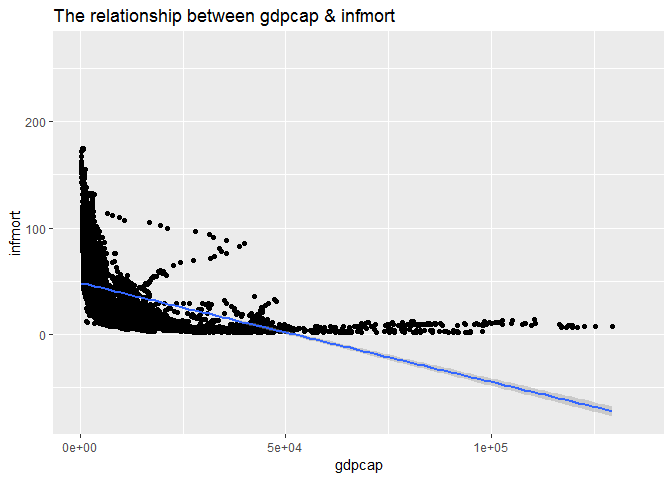
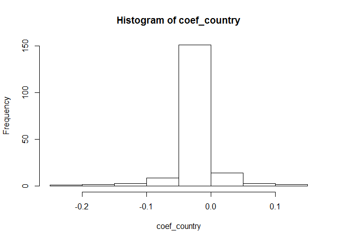
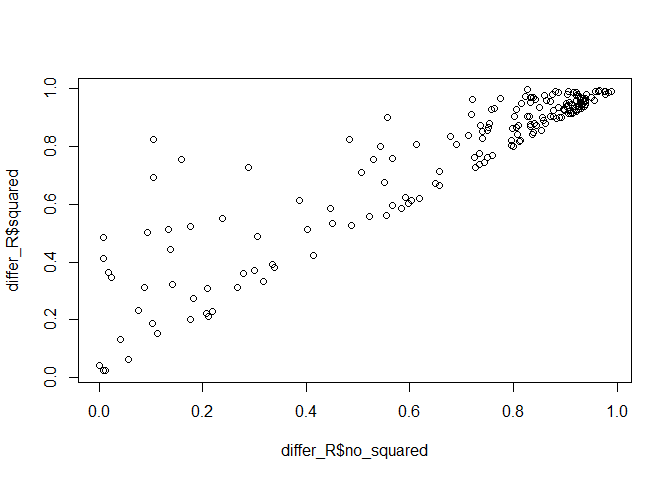

## Functions in the R Base Package


#### a) Longest name

```
## [1] "getDLLRegisteredRoutines.character"
```


#### b) Number of arguments


```
##           function. number_arguments
## 1              scan               22
## 2    format.default               16
## 3            source               16
## 4           formatC               14
## 5  merge.data.frame               13
## 6         prettyNum               12
## 7           system2               11
## 8              save               10
## 9            system               10
## 10          library                9
```


#### c) No arguments
**Conclusion:** By filtering, there are 224 functions with zero argument(no arguments). I think the main differences are that most of these functions are primitive functions as basic operators, such as "+"(addition), "<"(less than), "%%"(modulo), "!=", etc.

```
## [1] 224
```


## Infant Mortality and GPD per Capita
#### a) Highest and lowest infant mortality rates in 2017


##### **Table of countries with the 5 highest infant mortality rates in 2017**

```
##                    country infmort    gdpcap
## 1 Central African Republic    87.6  661.2400
## 2             Sierra Leone    81.7 1390.3003
## 3                  Somalia    79.7        NA
## 4                     Chad    73.4 1768.1534
## 5         Congo, Dem. Rep.    70.0  808.1332
```

##### **Table of countries with the 5 lowest infant mortality rates in 2017**

```
##      country infmort   gdpcap
## 1    Iceland     1.6 46482.96
## 2   Slovenia     1.7 31400.84
## 3    Finland     1.9 40585.72
## 4      Japan     1.9 39002.22
## 5 San Marino     2.0 56861.47
```


#### b) Overall regression
**Conclusion:** According to the question, I regard ¡°gdpcap¡± as independent variable, ¡°infmort¡± as dependent variable. The fit line indicates that infmort is inversely proportional to gdpcap. Almost all of scatters concentrate on the bottom left corner of plot, with a lower gdpcap value but higher infmort value, which means that the lower GDP per capita, the higher infant mortality rate overall. Besides, in the range of 0 to 5e+04, the infant morality rate is falling very fast, but after that, the rate is gradually getting slowly, which means the impact of GDP per capita on infant mortality rate is not so significant.

```
## 
## Call:
## lm(formula = infmort ~ gdpcap, data = data_WDI_clean, subset = ((!is.na(gdpcap)) & 
##     (!is.na(infmort))))
## 
## Residuals:
##     Min      1Q  Median      3Q     Max 
## -35.269 -19.980  -9.016  12.683 127.142 
## 
## Coefficients:
##               Estimate Std. Error t value Pr(>|t|)    
## (Intercept)  4.857e+01  4.926e-01   98.60   <2e-16 ***
## gdpcap      -9.318e-04  2.077e-05  -44.86   <2e-16 ***
## ---
## Signif. codes:  0 '***' 0.001 '**' 0.01 '*' 0.05 '.' 0.1 ' ' 1
## 
## Residual standard error: 26.84 on 4981 degrees of freedom
## Multiple R-squared:  0.2877,	Adjusted R-squared:  0.2876 
## F-statistic:  2012 on 1 and 4981 DF,  p-value: < 2.2e-16
```

<!-- -->


#### c) Regression by region
##### **The list of split data frames**

```
## List of 7
##  $ East Asia & Pacific       :'data.frame':	772 obs. of  12 variables:
##  $ Europe & Central Asia     :'data.frame':	1310 obs. of  12 variables:
##  $ Latin America & Caribbean :'data.frame':	887 obs. of  12 variables:
##  $ Middle East & North Africa:'data.frame':	504 obs. of  12 variables:
##  $ North America             :'data.frame':	56 obs. of  12 variables:
##  $ South Asia                :'data.frame':	207 obs. of  12 variables:
##  $ Sub-Saharan Africa        :'data.frame':	1247 obs. of  12 variables:
```

##### **The coefficient estimates for the slope for each region**

```
##                       region  coefs_region
## 1                 South Asia -5.658714e-03
## 2        Sub-Saharan Africa  -2.351682e-03
## 3 Latin America & Caribbean  -1.102494e-03
## 4        East Asia & Pacific -5.995109e-04
## 5      Europe & Central Asia -4.920161e-04
## 6 Middle East & North Africa -2.776021e-04
## 7              North America -8.223335e-06
```


#### d) Regression by country


##### **The percentage of the positive relationship between GDP per capita & infant mortality**

```
## [1] 0.05405405
```

##### **Make a histogram of the slope coefficients**
<!-- -->

##### **The list of country cases with the most at odds in the overall regression**
**Conclusion:** According to the question, I have found that there are 10 country cases most at odds with positive coefficient as shown below. However, the country with the greatest at odds is Madagascar.

```
##                     Country  Coefficient      P_value
## 1                Madagascar 1.358330e-01 1.473682e-02
## 2                   Burundi 1.133593e-01 1.178293e-03
## 3                   Comoros 9.876322e-02 2.527516e-03
## 4             Guinea-Bissau 6.987750e-02 2.567207e-02
## 5  Central African Republic 5.731636e-02 4.109290e-04
## 6                     Gabon 3.572182e-03 6.952342e-07
## 7                  Dominica 3.024546e-03 9.266712e-05
## 8               South Sudan 1.593684e-03 3.304944e-02
## 9      United Arab Emirates 9.847707e-05 4.620178e-08
## 10        Brunei Darussalam 8.352228e-05 1.012051e-04
```


#### e) Added squared term
**My idea to solve this question:** I will use two methods to analyze, one is calculating the average model adjusted R-squared with and without the squared term as the question requests, another one is using a scatter plot.

##### **Method 1: The difference of the average model adjusted R-squared**


```
## [1] 0.6646889 0.7458917
```


```
## [1] 0.08120282
```
**Conclusion:** When I add the squared term of GDP per capita, 151 out of 186 with country regressions have improved accurately. R square increases 0.08, from 0.665 to 0.746. Generally, it is better to look at adding squared term rather than not adding, since the model becomes more accurately. Therefore, I recommend to keep the squared term of GDP per capita.


##### **Method 2: Using a scatter plot**
<!-- -->

**Conclusion:** I use a plot to explain my results as shown below, the x-axis is ¡°no_squared¡±(not adding squared term of GDP per capita), the y-axis is ¡°squared¡±(adding squared term). It can be seen that, all of the scatters are located above the 45 degree line, that is, for the same sample, the value of adding the squared term is bigger, so the fitting effect of the model becomes better. Generally, it is better to look at adding squared term rather than not adding, since the model becomes more accurately. Therefore, I recommend to keep the squared term of GDP per capita.


