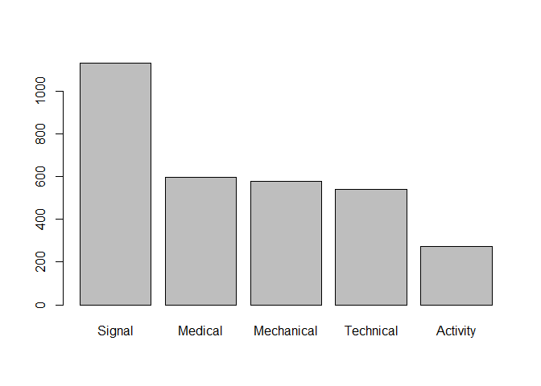

## 1. Words in Ulysses


### a) Words with z


##### **Number of words contain z's**
**Conclusion:** Among the z-words, there are 293 words containing one z, 46 words containing two z's and 1 word containing three z's.

```
##   times_z table.times_z.
## 1       1            293
## 2       2             46
## 3       3              1
```


##### **The furthest distance between two z's in the word**

```
## [1] "százharminczbrojúgulyás"
```


### b) Vowels
##### **Words start and end with a vowel**

```
## [1] 876
```


##### **Words start with two or more vowels**

```
## [1] 341
```


##### **Words with most consecutive vowels**

```
## [1] "frseeeeeeeeeeeeeeeeeeeefrong"
```


### c) English spelling
**My idea to solve this question:** I will use two methods to analyze this question. Firstly, I divide all the words into the categories of "holding the rule" and "not holding the rule". I suppose that some special words also belong to "not holding the rule", so the sum of the proportion of "holding the rule" and "not holding the rule" equals to 1. Therefore, there are 78.64% of words holding the rule while 21.36% of words not holding the rule.

##### **Method 1: The sum of proportion equals to 1**

```
## 
##     holding not holding 
##         799         217
```

```
## 
##     holding not holding 
##   0.7864173   0.2135827
```


##### **Method 2: The proportion of words when the rule does not hold**
Secondly, since there exists some special words like "vieille", I suppose that they don't belong to "not holding the rule", so I will exclude these special words. Therefore, the sum of the proportion of "holding the rule" and "not holding the rule" does not equal to 1. According to my selection, there are 201 words not holding the rule, and the proportion is 19.78%.

```
## [1] 201
```

```
## [1] 0.1978346
```


## 2. MTA Delays


### a) Reduce the data

```
## # A tibble: 6 x 2
##   text                                                 created_at         
##   <chr>                                                <dttm>             
## 1 Service Update: Northbound C trains continue to run~ 2018-04-12 01:09:29
## 2 "Service update: Some northbound E trains are runni~ 2018-02-13 18:01:50
## 3 "4 and 6 train service has resumed. \nhttps://t.co/~ 2018-07-09 06:12:11
## 4 7 and 7 express trains are running with delays in b~ 2018-01-11 12:52:10
## 5 "F train service has resumed. \nhttps://t.co/i80bMp~ 2018-08-22 23:03:09
## 6 Southbound 3 trains are running with delays because~ 2018-04-11 14:19:49
```


### b) Time of Delay
**Briefly Comment:** According to the question, I just subset the "(Dd)elay", but remove all the "(Rr)esume|resuming" and "update|UPDATE" away. Since I see many words of "resuming", so I also remove it.

```r
tweets_reduced_delay = tweets_reduced %>%
  filter(str_detect(text, pattern = "[Dd]elay")) %>%
  filter(!str_detect(text, pattern = "[Rr]esum|[Uu][Pp][Dd][Aa][Tt][Ee]"))
head(tweets_reduced_delay)
```

```
## # A tibble: 6 x 2
##   text                                                 created_at         
##   <chr>                                                <dttm>             
## 1 7 and 7 express trains are running with delays in b~ 2018-01-11 12:52:10
## 2 Southbound 3 trains are running with delays because~ 2018-04-11 14:19:49
## 3 Southbound 4 and 5 trains are running with delays b~ 2018-02-24 22:46:34
## 4 Southbound A and C trains are running with delays b~ 2018-06-08 01:23:24
## 5 Northbound 4 trains are running with delays because~ 2018-02-26 15:21:18
## 6 Northbound Q trains are running with delays because~ 2018-01-09 21:20:02
```

**What I find:** From the "column" perspective, morning is the time period with the minimum train delays, while mid-day is the time period with the maximum train delays, followed by night and evening. This phenomenon may be explained by that, these three time periods are the peak time for arranging trains. People will dine out, or just come home from work. As a result, increased human traffic has contributed to train delays. From the “row” perspective, Saturday is the weekend with the minimum train delays, while Monday is the weekday with the maximum train delays, followed by Tuesday. This phenomenon can be explained by that Monday is the first working day in a week.

```
##            
##             morning mid-day afternoon evening night
##   Monday         54     207        94     147   134
##   Tuesday        37     163       104     152   147
##   Wednesday      23     157        83     166   134
##   Thursday       32     198        69     127   137
##   Friday         39     171        82     140   143
##   Saturday       55     121        62      80   113
##   Sunday         65     128        44      90   137
```


### c) Type of Delay
**My idead to solve this question:** I select the reasons for train delays as follows: signal, mechanical, technical and activity. Among them, I combine “medical”, “sick”, “injured” and “passenger” into “medical” category , and combine “track” and “switch” into “technical” category.

```r
tweets_reduced_delay_type = tweets_reduced_delay %>%
  mutate(Signal = ifelse(str_detect(text, pattern = "signal"),1,0),
         Medical = ifelse(str_detect(text, pattern = "medical|sick|injured|passenger"),1,0), 
         Mechanical = ifelse(str_detect(text, pattern = "mechanical"),1,0),        
         Technical = ifelse(str_detect(text, pattern = "track|switch"),1,0),
         Activity = ifelse(str_detect(text, pattern = "activity"),1,0))
library(reshape2)
type = melt(tweets_reduced_delay_type, measure.vars = c("Signal", "Medical", "Mechanical", 
                                                        "Technical", "Activity"))
type= type %>%
  filter(value==1)
table(type$variable)
```

```
## 
##     Signal    Medical Mechanical  Technical   Activity 
##       1129        595        576        538        272
```

```r
barplot(table(type$variable))
```

<!-- -->

### d) Which train lines affected?

```r
library(purrr)
delay_lines <- str_extract_all(tweets_reduced_delay$text, pattern = "( |^)[1-7|A-G|J|L-N|Q-S|W-Z](,| )")
extract_lines <- str_extract_all(delay_lines, pattern = "[1-7|A-G|J|L-N|Q-S|W-Z]") %>%
  map(~unique(.))
days <- str_replace(as.list(tweets_reduced_delay$week), pattern = "Saturday|Sunday", "Weekends")
days <- str_replace(as.list(tweets_reduced_delay$week), pattern = "Monday|Tuesday|Wednesday|Thursday|Friday", "Weekdays")
delay_lines_new <- cbind(extract_lines, days)
weekdays <- unlist(delay_lines_new[which(days == "Weekdays")])
weekends <- unlist(delay_lines_new[which(days == "Weekends")])
weekday_count <- data.frame(table(weekdays)) %>% arrange(desc(Freq))
weekend_count <- data.frame(table(weekends)) %>% arrange(desc(Freq))
weekend_count
```

```
## [1] Freq
## <0 rows> (or 0-length row.names)
```

